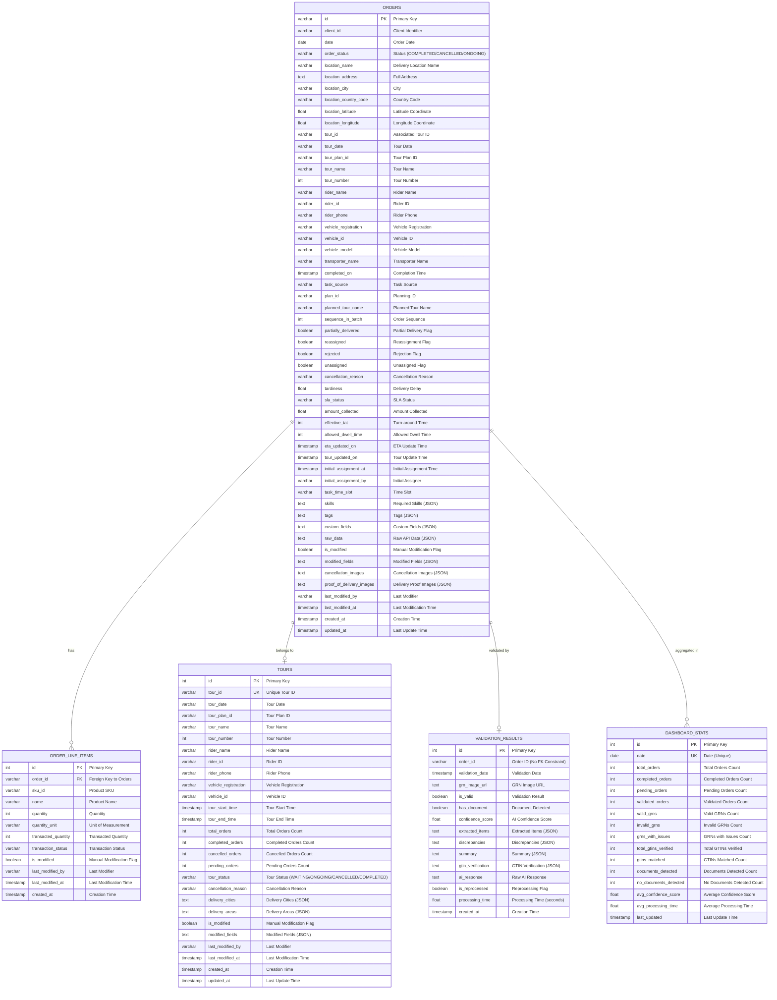

# LocusAssist Database Schema Visualization

## Entity Relationship Diagram

## Data Flow Diagram

## Table Statistics

| Table | Records | Key Relationships | Purpose |
|-------|---------|-------------------|---------|
| **orders** | 1,472 | Central hub table | Main order management |
| **order_line_items** | 5,902 | FK to orders | Item-level tracking |
| **tours** | 409 | Logical link to orders | Tour management |
| **validation_results** | 1 | Logical link to orders | AI validation |
| **dashboard_stats** | 0 | Aggregated from others | Analytics |

## Key Relationships

### 1. **Primary Foreign Key**
- `order_line_items.order_id` → `orders.id` (One-to-Many)

### 2. **Logical Relationships** (No FK constraints)
- `orders.tour_id` ↔ `tours.tour_id` (Many-to-One)
- `validation_results.order_id` ↔ `orders.id` (One-to-One)

### 3. **Data Flow**
1. **Orders** are created from Locus API
2. **Order Line Items** are linked to orders
3. **Tours** are associated with orders via `tour_id`
4. **Validation Results** are created for orders
5. **Dashboard Stats** are aggregated from all tables

## Status Distributions

### Order Status
- **COMPLETED**: 1,302 (88.5%)
- **CANCELLED**: 147 (10.0%)
- **ONGOING**: 23 (1.6%)

### Tour Status
- **COMPLETED**: 402 (98.3%)
- **ONGOING**: 6 (1.5%)
- **CANCELLED**: 1 (0.2%)

## Features

### Editing Support
- All main tables have `is_modified` flags
- Track `last_modified_by` and `last_modified_at`
- Store `modified_fields` as JSON

### Location Data
- Full address information
- Latitude/longitude coordinates
- City and country codes

### Performance Tracking
- SLA status and tardiness
- Turn-around times
- Amount collection tracking

### AI Integration
- Validation results with confidence scores
- Document detection
- GTIN verification
- Processing time tracking
